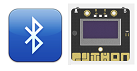
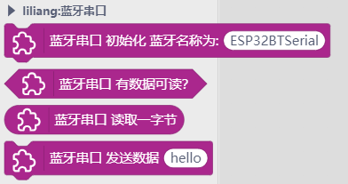
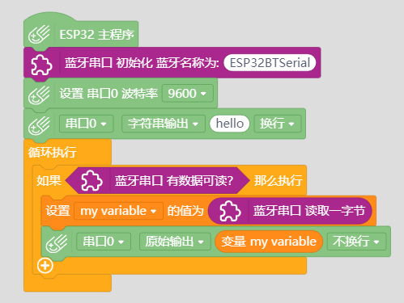

# Mpython Bluetooth Serial 掌控板蓝牙串口




---------------------------------------------------------


## 链接
- **本用户库加载地址:** ```https://github.com/liliang9693/ext-ESP32BluetoothSerial```
- **Mind+下载地址：**[http://mindplus.cc](http://mindplus.cc "http://mindplus.cc")    

## 简介

- **介绍：** 本扩展库为掌控板蓝牙串口功能，从Mind+导入本库。  

## Blocks



## 示例



## License

MIT

## 硬件支持

MCU                | JavaScript    | Arduino   | MicroPython    | Remarks
------------------ | :----------: | :----------: | :---------: | -----
micro:bit        |             |       x       |             | 
mpython        |             |        √      |             | 
arduino uno    |             |        x      |             | 
 

## 更新日志
- V0.1.0 20200130 第一版发布


